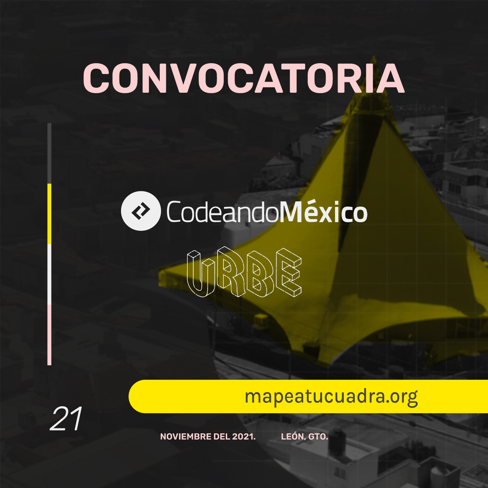

---
#
# You don't need to edit this file, it's empty on purpose.
# Edit sleeks's default layout instead if you wanna make some changes
# See: https://jekyllrb.com/docs/themes/#overriding-theme-defaults
#
layout: default
title: Mapea tu Cuadra
---
URBE León en colaboración con Codeando México, te invitan a participar en la convocatoria “Mapea tu Cuadra”, el cual busca promover la participación ciudadana en temas de interés público a través de un proyecto piloto de mapeo colaborativo en la colonia Andrade. 

